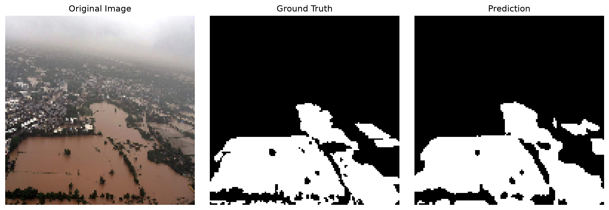
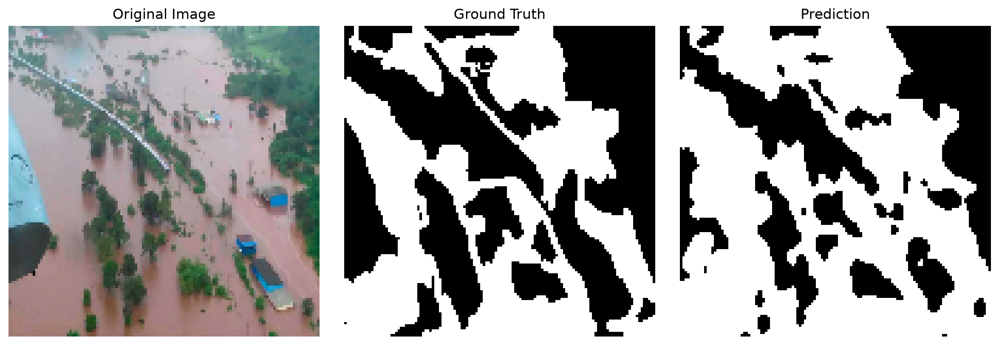
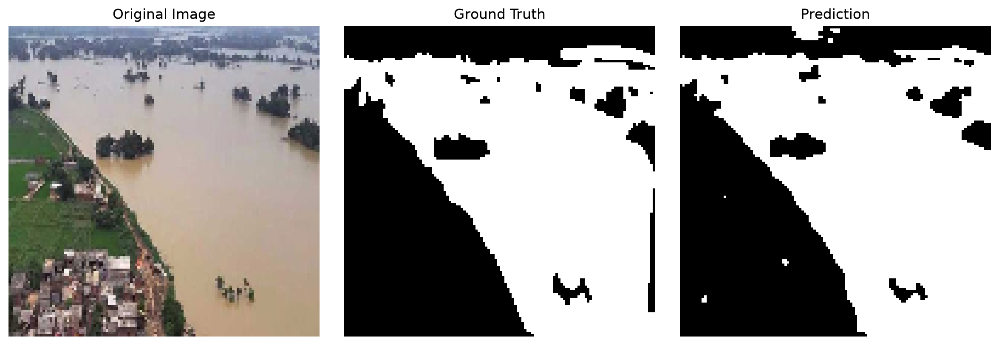

# 🌊 FloodVision: Semantic Flood Segmentation using U-Net

## 🚀 Project Overview

FloodVision is a deep learning project that performs **pixel-level flood segmentation** on aerial imagery using a **U-Net** architecture implemented in **PyTorch**.

Unlike traditional image classification models that answer *"Is this image flooded?"*, FloodVision predicts **whether every individual pixel belongs to a flooded region**, producing detailed binary segmentation masks that can support disaster assessment, infrastructure monitoring, and emergency response.

The project emphasizes **clean engineering practices**, **robust dataset validation**, and a **production-style training and evaluation pipeline** rather than simply training a neural network.

---
## Highlights

- Built a complete semantic segmentation pipeline in PyTorch.
- Cleaned the dataset by identifying and removing corrupted image-mask pairs.
- Achieved **0.8801 Dice Score** and **0.7591 IoU** on the validation set.
- Modular training, evaluation, and inference scripts.
---


## 🖼️ Sample Predictions





Additional qualitative examples are available in the `predictions/` directory.

---

# ✨ Key Features

* Custom PyTorch Dataset with automatic preprocessing
* Image-mask pair validation before training
* Automatic removal of corrupted image-mask pairs
* U-Net encoder-decoder architecture with skip connections
* Dice Loss optimization for semantic segmentation
* Evaluation using both Dice Score and IoU (Jaccard Index)
* Automatic best-model checkpoint saving
* Prediction visualization pipeline
* Modular project structure
* Extensive runtime validation and explicit error handling

---

# 🏗️ Architecture

## Model

The project uses **U-Net**, a convolutional neural network designed specifically for semantic segmentation.

Unlike image classification CNNs that output a single class prediction, U-Net predicts a label for **every pixel** in the input image.

```
Input Image
      │
      ▼
Encoder
(Feature Extraction)
      │
      ▼
Bottleneck
      │
      ▼
Decoder
(Upsampling)
      │
      ▼
Flood Mask
```

### Why U-Net?

The cleaned dataset contains only **283 valid samples**.

U-Net performs exceptionally well on relatively small datasets because:

* the encoder extracts semantic features,
* the decoder reconstructs spatial resolution,
* skip connections preserve fine-grained spatial information required for accurate flood boundary localization.

### Skip Connections

Rather than adding encoder and decoder features, U-Net **concatenates** them channel-wise.

This allows the decoder to recover high-resolution spatial information that would otherwise be lost during pooling.

---

# ⚙️ Technical Stack

| Component           | Technology |
| ------------------- | ---------- |
| Language            | Python     | 
| Deep Learning       | PyTorch    | 
| Image Processing    | OpenCV     | 
| Numerical Computing | NumPy      | 
| Visualization       | Matplotlib |
| Model               | U-Net      |
| Optimizer           | Adam       |

---

# 🔄 Training Pipeline

```
   ┌───────────────────────────┐
   │       Raw Dataset         │  -> Reads source aerial images and label paths
   └─────────────┬─────────────┘
                 │
                 ▼
   ┌───────────────────────────┐
   │     PyTorch DataLoader    │  -> Aggregates data, drops invalid pairs, applies
   └─────────────┬─────────────┘     uniform resizing, and batches tensors
                 │
                 ▼
   ┌───────────────────────────┐
   │    Batch Verification     │  -> Runs integrity checks on spatial dimensions
   └─────────────┬─────────────┘     and bounding ranges before GPU ingestion
                 │
                 ▼
   ┌───────────────────────────┐
   │     U-Net Architecture    │  -> Compresses image features (Encoder) and upsamples
   └─────────────┬─────────────┘     spatial resolutions with Skip Connections (Decoder)
                 │
                 ▼
   ┌───────────────────────────┐
   │   Dice Loss Optimization  │  -> Compares sigmoid predictions against ground truth masks
   └─────────────┬─────────────┘     to evaluate intersect-over-union discrepancies
                 │
                 ▼
   ┌───────────────────────────┐
   │  Training Loop (Backprop) │ -> Computes autograd gradients; Adam scales updates
   └─────────────┬─────────────┘     per parameter to optimize network weights
                 │
                 ▼
   ┌───────────────────────────┐
   │    Evaluation & Testing   │  -> Computes strict IoU validation benchmarks and 
   └───────────────────────────┘     saves peak-performing model checkpoints to disk
```

---

# 🗺️ Developmental Roadmap

```

📁 Phase 1: Data Engineering & Validation (Completed)
 └── ✓ Dataset Exploration   -> Analyzed raw aerial images & mask distributions
 └── ✓ Dataset Cleaning      -> Audited dimensions; dropped 7 corrupted/mismatched pairs
 └── ✓ Custom Dataset Loader -> Implemented file-reading, parsing, and normalization layers
 └── ✓ Train/Validation Split -> Divided codebase into 226 train / 57 validation splits
 └── ✓ PyTorch DataLoader    -> Configured multi-threaded batching & memory pinning

🧠 Phase 2: Core Architecture & Core Loop (Completed)
 └── ✓ U-Net Architecture    -> Built symmetric CNN with channel-wise skip connections
 └── ✓ Dice Loss Formulation -> Implemented mathematical objective maximizing mask overlap
 └── ✓ Training Loop         -> Engineered full forward/backward autograd execution loops
 └── ✓ Validation Loop       -> Isolated model evaluations within torch.no_grad() contexts

📊 Phase 3: Metrics, Visualization & Scaling (Completed)
 └── ✓ Evaluation Metrics    -> Tracked live validation Dice Scores and strict IoU metrics
 └── ✓ Prediction Pipeline   -> Generated overlay visualizations comparing predictions to Ground Truths
 └── ✓ Future Experiments    -> Monitoring network convergence and optimizing Adam hyper-parameters
 ```

 ---

# 📊 Dataset

## Raw Dataset

* Total image-mask pairs: **290**

During dataset validation, **7 samples** were automatically removed because the image and mask dimensions did not match.

Rather than resizing mismatched masks to fit their paired images, the corrupted samples were excluded to prevent training on incorrect supervision signals.

### Final Dataset

| Split        | Samples |
| ------------ | ------: |
| Valid Images | **283** |
| Training     | **226** |
| Validation   |  **57** |

---

# 📊 Performance

| Metric              | Validation |
| ------------------- | ---------: |
| Dice Score          | **0.8801** |
| IoU (Jaccard Index) | **0.7591** |

Dice Loss was used during optimization because it directly measures overlap between predicted and ground-truth masks.

IoU was additionally reported since it is one of the most widely used evaluation metrics for semantic segmentation, enabling easier comparison with existing literature.

---

# 🧠 Engineering Decisions

## Image Standardization

The original dataset contained images ranging from **219×759** up to **3648×5472**.

Neural networks require tensors of identical dimensions within each batch.

All images and masks were resized to a common resolution before training.

This provides:

* faster experimentation,
* lower memory usage,
* stable batching,
* a reliable baseline for future improvements.

---

## Dataset Validation

Before training, every image-mask pair was verified.

Checks included:

* image readability,
* mask readability,
* matching filenames,
* matching dimensions.

Corrupted pairs were removed instead of repaired because resizing cannot fix incorrectly paired annotations.

---

## Dice Loss

Dice Loss was selected because the objective is maximizing segmentation overlap rather than overall pixel accuracy.

Although the dataset is reasonably balanced, Dice remains a more informative optimization objective for binary segmentation.

---

## Inference

Inference is performed inside a `torch.no_grad()` context.

Benefits include:

* reduced memory consumption,
* faster execution,
* no unnecessary gradient computation.

---

# 📂 Project Structure

```
FloodVision/
│
├── data/
│   ├── images/
│   └── masks/
│
├── datasets/
│   └── flood_dataset.py
│
├── losses/
│   └── dice_loss.py
│
├── metrics/
│   └── iou.py
│
├── models/
│   └── unet.py
│
├── predictions/
│
├── train.py
├── evaluate.py
├── predict.py
├── test.py
├── requirements.txt
└── README.md
```

---

# 🛠️ Installation

Clone the repository

```bash
git clone https://github.com/OjalSingh/floodvision.git

cd floodvision
```

Create a virtual environment

```bash
python -m venv venv
```

Activate it

Windows

```bash
venv\Scripts\activate
```

Linux / macOS

```bash
source venv/bin/activate
```

Install dependencies

```bash
pip install -r requirements.txt
```

---

# 🚀 Usage

Train the model

```bash
python train.py
```

Evaluate the model

```bash
python evaluate.py
```

Generate prediction visualizations

```bash
python predict.py
```

---

# 📈 Future Improvements

* Data augmentation using Albumentations
* Mixed Precision Training (AMP)
* Learning rate scheduling
* ResNet34 encoder backbone
* Attention U-Net
* Test-time augmentation
* ONNX/TorchScript export
* Dockerized inference pipeline

---

# 📌 Results Summary

FloodVision demonstrates a complete semantic segmentation workflow, covering:

* robust dataset preprocessing,
* custom U-Net implementation,
* automated training,
* checkpoint management,
* quantitative evaluation,
* qualitative prediction visualization,
* modular and maintainable code organization.

The project was built with an emphasis on writing clean, production-oriented PyTorch code while following engineering practices commonly used in real-world computer vision systems.
